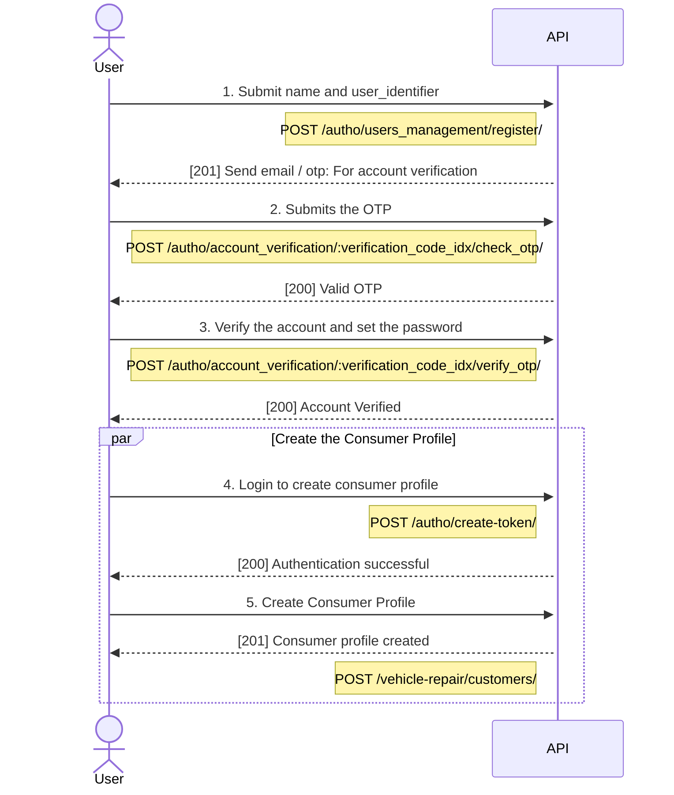

# Autho App

This app is used for all the user and auth related operations.


## Models

Multiple modles are used in this app to proporly handle authentication and authorization.

### User
This model is used to store the user information.

## Serializers
All the serializers here are related to serializing and deserializing the auth data.

### UserRegistrationSerializer
This serializer inherits the `serializers.Serializer` and is used during the registration of the new user.
This has two fields `user_identifier` and `name`.
**Name** is required in this serializer because our current user registration design on the frontend asks for name and user_identifier in the registration form.
**Passowrd** field is not required here because unusable password for the user is set here and the actual password is set after they verify their user_indentifier **( *mobile or email* )**.

#### Create method
This method validates the user identifier and name and creates the user. For this it first checks if the identifier is valid email or a valid mobile number.
If the identifier is valid email then it creates a user with email and if the identifier is valid mobile number then it creates a user with phone number.
**Note**: *Unusable `password` is set for the newly created user.*

## Apis
All the apis are placed under the api directory.

### TokenObtainPairView
This api view is used for **`access` and `refresh` token generation**. It just inherits the `TokenObtainPairView` of `rest_framework_simplejwt` and adds the permission class `BazraPermission` to the permission class list.

### TokenRefreshView
This api view is used to refresh the **`access` token**. It just inherits the `TokenRefreshView` of `rest_framework_simplejwt` and adds the permission class `BazraPermission` to the permission class list.

### TokenVerifyView
This api view is used to verify the **`access` or the `refresh` token**. It just inherits the `TokenVerifyView` of `rest_framework_simplejwt` and adds the permission class `BazraPermission` to the permission class list.


### UserManagemeneViewSet
This file is responsible to perform all the user registration and info change logic for the project.
**Any user info modification logic should be added here.**
Here are all the actions available in this viewset

#### Register
This action is used to register a new user. This action uses the [`UserRegistrationSerializer`][userregserializer] to validate and create the user. After the creation of the user, `VerificationCode` is generated for `account_verification`. **Note**: *`user_identifier` and `is_account_verification` flag is saved on code's meta so that these values can be used to verify the code*
```python
code.meta.update(
    {
        "identifier": serializer.validated_data["user_identifier"],
        "is_account_verification": True,
    }
)
```
The `VerificationCode` is then sent to the user through email or sms depending on the user_identifier type.
Then after the verification idx with message is returned to the user.
```python
{
    "verification": {
        "idx": code.idx,
    },
    "message": "Please check your mobile and email for otp code ",
}

```


## Diagrams

### Registration Sequence
This sequence diagram illustrates the process of user registration process which involves **user registration, OTP verification, and consumer profile creation steps.** Initially, the user submits their name and user identifier to the API endpoint `/autho/users_management/register/`, and the API responds with a [201] status code, sending an email or OTP for account verification in addition to `verification_code_idx` in the response. The user then submits the received OTP to `/autho/account_verification/:verification_code_idx/check_otp/` to validate the otp code, and upon successful validation, the API responds with a [200] status code. Subsequently, the user verifies their account and sets a password via the endpoint `/autho/account_verification/:verification_code_idx/verify_otp/`, receiving a [200] confirmation from the API. Additionally, the user is automatically logged in by the frontend to create a consumer profile by submitting their credentials to `/autho/create-token/`, with the API responding with a [200] status code for successful authentication, user's consumer profile is created with the request to `/vehicle-repair/customers/`, and the API confirms the creation with a [201] status code. This process ensures that the user's account is verified and a consumer profile is created, allowing for further interactions within the application




[userregserializer]: #userregistrationserializer
